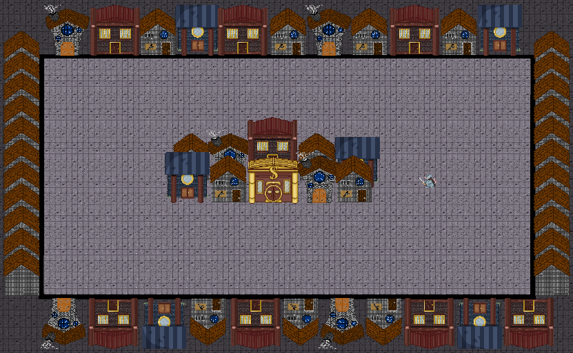
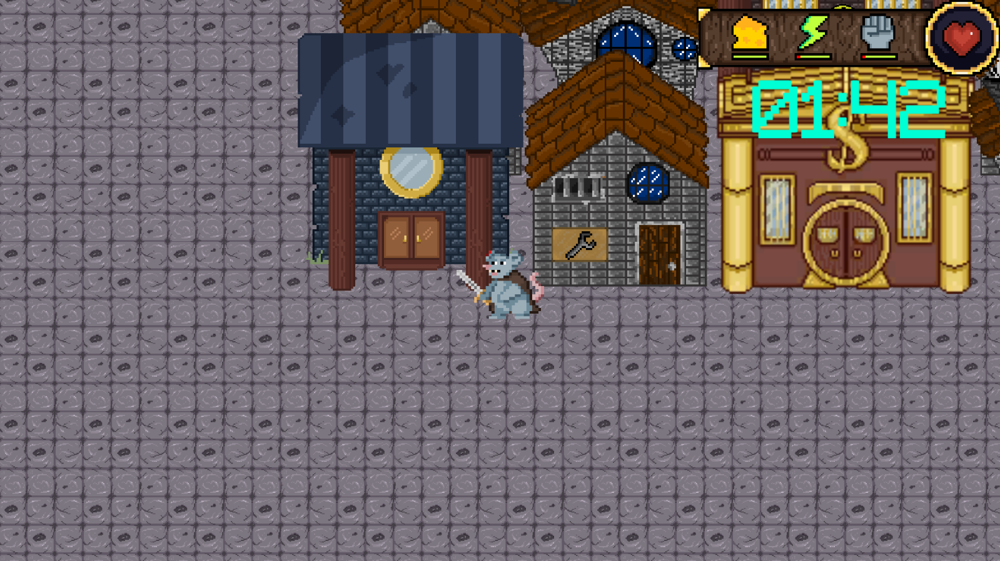
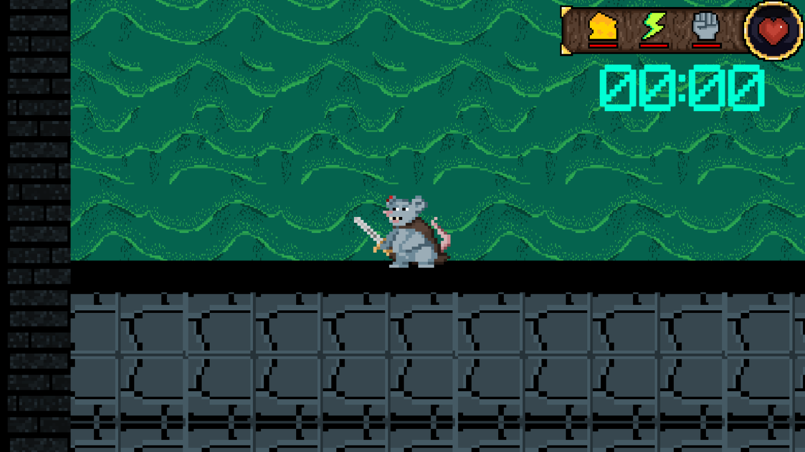
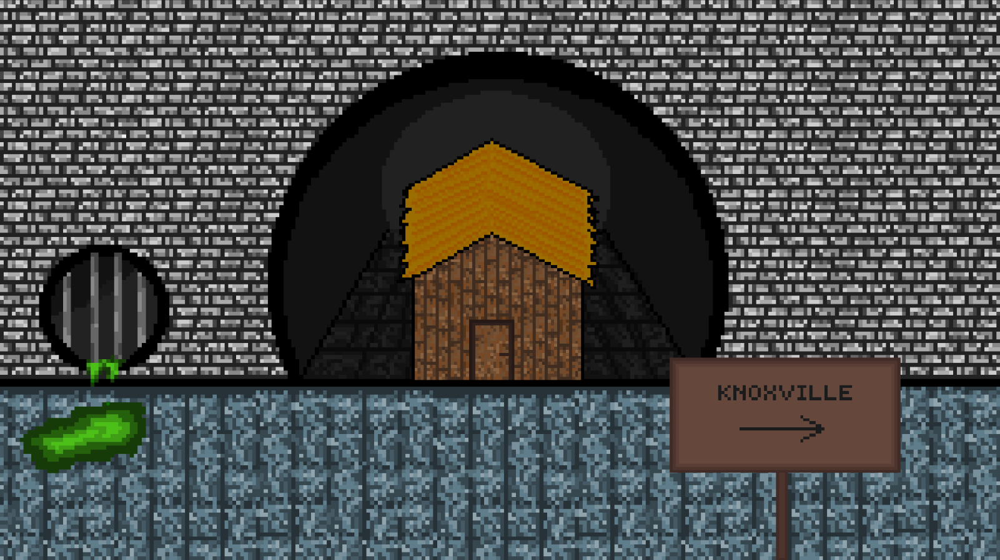
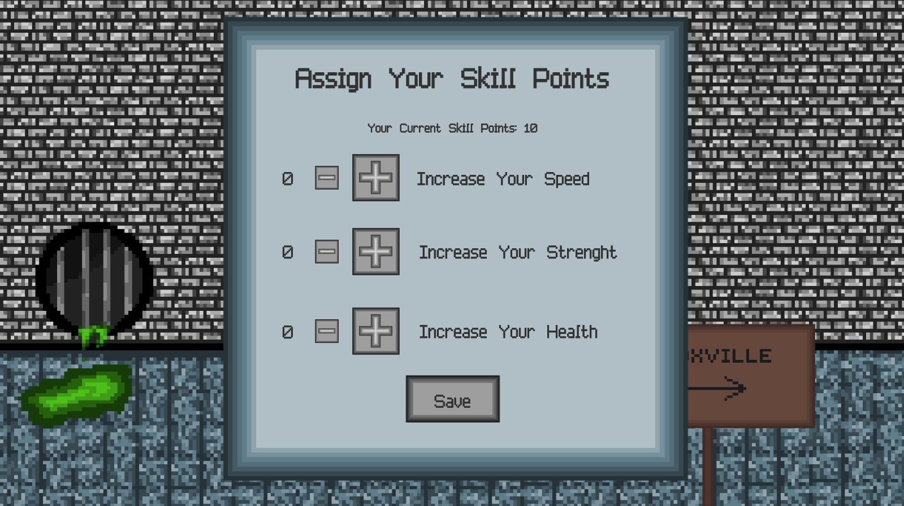
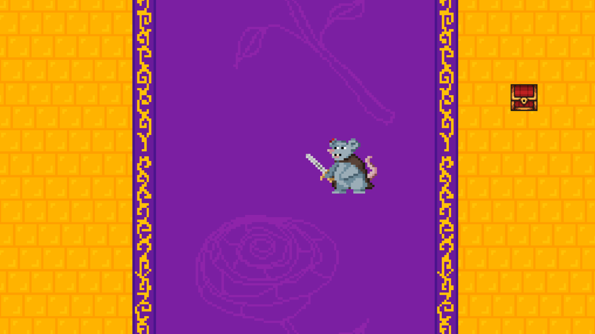
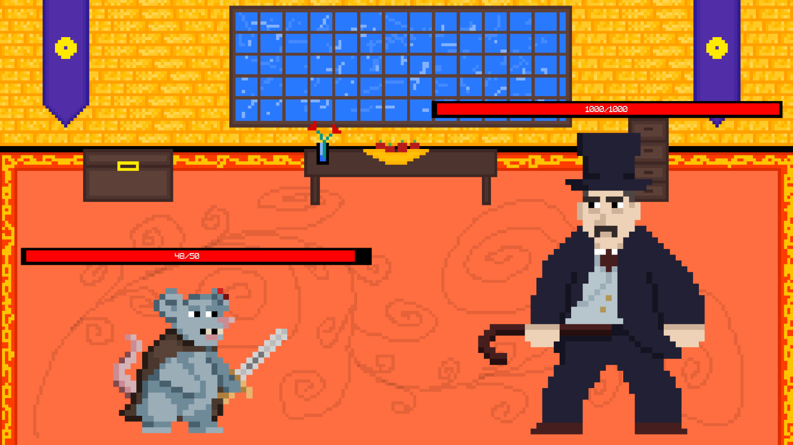

# **About the Project**

"Amar- Szczurza Historia" is an University project in which 7 people took part. We were divided into three roles: graphic designers, scriptwriters and programmers. I personally did the programming and created few pixel-arts. 

## Short story introduction

The game is set in the city of Knoxville, at the turn of the 20th century. Apart from people, the city is also inhabited by magical creatures - and one of them is our main character, Amar the rat. He is not one of the strongest creatures, but in order to ensure the survival of his family he goes out to the city of Knoxville night after night to steal some food. Once upon a time, Amar wanted to rob the house of the famous and influential Banker Ebenezer, who was holding a banquet that day for the most influential personalities in the city. Unfortunately, the little thief was caught stealing and while fleeing from the banker's house, he lost all his supplies, plus Ebenezer blew off his ear. Amar decided to take revenge on the banker and avenge his pride.

## Mechanics

The player's job is to collect food for his family by robbing houses in the city of Knoxville. While looting houses, apart from food, you can earn skill points, which you can use after returning home to strengthen your character's stats. We have a set amount of time to collect food, and with each night the chance of getting food decreases. If we do not collect enough food our life will decrease. The game ends when the player defeats the main boss.

## Screenshots

